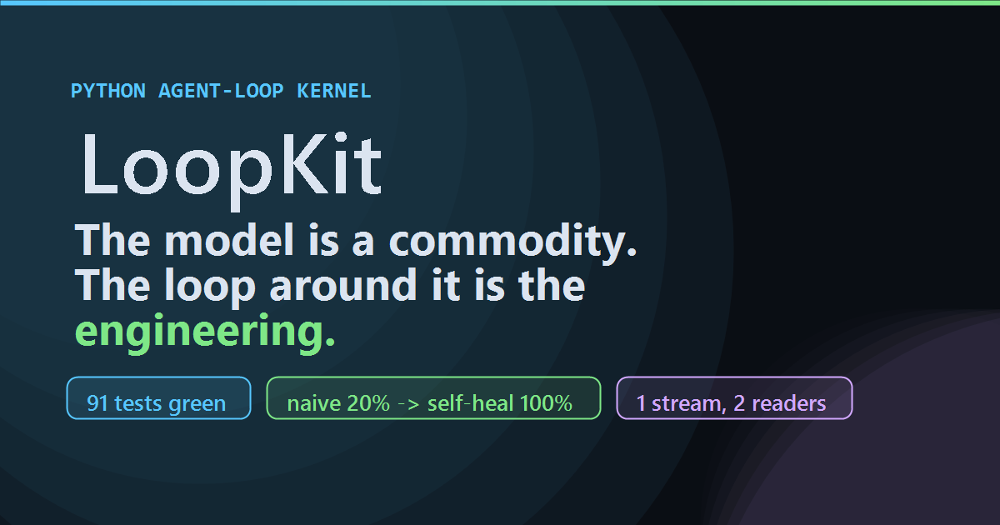

<div align="center">

# 🔁 LoopKit

**A framework-agnostic agent-loop kernel — with observability, safety, and self-healing built in.**

*The model is a commodity. The loop around it is the engineering.*



**🔗 Live showcase → https://prashanth261993.github.io/loopkit/** — watch a real
agent heal itself in the browser, zero backend.

</div>

---

LoopKit is a small Python kernel you wrap around **your own** LLM and tools. It
gives you the hard parts of an agent runtime — termination control, context
management, tool orchestration, self-healing, and a versioned event stream — so
that a real agent reduces to just **`tools + policies`**.

To prove the abstractions are real, LoopKit ships a family of thin, importable
agents built on the same kernel: a **PR Fixer**, a **Dependency Updater**, and
an **Accessibility Auditor**.

## Why this exists

Most "agent frameworks" bury the loop inside a monolith. LoopKit inverts that:
the loop is the product, and everything else — the model, the tools, the
stopping rules, the memory strategy — is a pluggable interface. The result is a
runtime you can **observe, test, and measure**.

## Architecture

```
Layer 4  dashboard/        React/TS — one consumer of the event stream, works for every agent
Layer 3  loopkit-agents/   pr-fixer · dep-updater · a11y-auditor  (importable, each w/ evals)   ← M5 ✅ shipped
Layer 2  loopkit-tools/    shared tools: subprocess · fs · git · http                           ← M5 ✅ shipped
Layer 1  loopkit/          kernel · policies · events · evals · adapters                        ← M0–M4.5 ✅ shipped
```

The **seam** between the Python kernel and the TypeScript dashboard is a single
versioned JSON event schema (`events.py`). The kernel emits events; a JSONL file
records them for replay/CI/evals, and a live sink streams them to the dashboard.
Both consumers read the *same* stream — so what you measure is exactly what you
see.

## Pluggable interfaces

| Interface | Purpose |
|---|---|
| `ModelAdapter` | bring your own LLM (OpenAI-compatible, Ollama, Anthropic, or a scripted mock) |
| `Tool` / `ToolRegistry` | user-registered capabilities, with a safety gate |
| `StopPolicy` (composable) | goal ∨ max-iters ∨ budget ∨ no-progress |
| `ContextStrategy` | compaction / summarization / Reflexion memory *(M1+)* |
| `HealPolicy` + `Critic` | swappable self-healing *(M2)* |
| `Sink` | JSONL, in-memory, live dashboard |

## Safety by default

Destructive tools (file writes, git, subprocess) are **dry-run by default**.
Real side effects require the caller to pass an explicit **allow-list**, enforced
at the `ToolRegistry` boundary and recorded in the run's `run.start` event — so
every recorded run is self-describing about what it was permitted to do.

## Quick start (zero LLM)

```bash
python -m venv .venv && .venv\Scripts\activate    # Windows
pip install -e packages/loopkit[dev]
python examples/m0_zero_llm.py                    # see the loop, no LLM/network
python examples/your_first_agent.py               # your own agent: it heals & grades itself
pytest
```

`examples/m0_zero_llm.py` runs the full loop with **no LLM and no network** using
the `MockAdapter`, then verifies the emitted event stream is well-formed and the
safety gate held. `examples/your_first_agent.py` is the **~40-line file you
copy** to build your own agent — it heals once and scores naive 0% vs self-heal
100% on the same task.

**→ Full guided walkthrough: [`GETTING_STARTED.md`](GETTING_STARTED.md)** — an
L0→L4 ladder from *see the loop* to *grade it*, one keyless command per rung.

### See it in the dashboard

```bash
python examples/m3_observe.py        # writes dashboard/public/sample.jsonl
cd dashboard && npm install && npm run dev   # → http://localhost:5173
```

Open the URL and hit **★ Play the sample run**. The dashboard is just another
reader of the same event stream — JSONL replay (no backend), live SSE, or file
upload. Details in [`GETTING_STARTED.md`](GETTING_STARTED.md) (L3).

The same build also serves the **showcase landing page** at
[`/showcase.html`](http://localhost:5173/showcase.html) in dev — an
auto-playing replay, concept explainers, and naive-vs-heal charts. In production
it's promoted to the site root by the Pages workflow (see the
[live showcase](https://prashanth261993.github.io/loopkit/)).

## The agents (proof the abstractions are real)

Three shipped agents live in `packages/loopkit-agents`, each built on the shared
tools in `packages/loopkit-tools`. Every one is the same shape — `tools +
policies` — and every one obeys the **Agent Contract**: a single predicate is
both the critic's `reject_final` (what it *enforces* at runtime) and the eval
task's `requirement` (what it's *measured* against).

```bash
pip install -e packages/loopkit-tools -e packages/loopkit-agents
python examples/m5_agents.py    # demo + grade all three; records a showcase run
```

| Agent | Heals when… | naive → self-heal |
|---|---|---|
| **a11y-auditor** | it ships HTML that still fails the scan | 0% → 100% |
| **dep-updater** | a floating version leaves the build red | 0% → 100% |
| **pr-fixer** | it declares victory before tests pass | 0% → 100% |

```python
from loopkit_agents import a11y_auditor
from loopkit.agent import demo, grade

demo(a11y_auditor)               # RUN it once (no writes without an allow-list)
print(grade(a11y_auditor).to_markdown())   # GRADE it: naive vs self-heal
```

`examples/m5_agents.py` also records the a11y-auditor's self-healing run to
`dashboard/public/a11y_showcase.jsonl` — a real agent healing itself, replayable
in the dashboard with zero backend.

## Status

Built inside-out, milestone by milestone:

- **M0 — Scaffold** ✅ kernel, event seam, mock adapter, JSONL sink, safety gate, zero-LLM loop
- **M1 — Runtime** ✅ composable stop policies, governor, context strategy, real adapters
- **M2 — Self-heal** ✅ actor–critic, retry/backoff, Reflexion memory, anti-thrash
- **M3 — Observe** ✅ SSE server + React dashboard (live + JSONL replay), drillable event rows
- **M4 — Evals** ✅ naive-vs-self-healing, graded on **task success** not loop status (+80pp, measured)
- **M4.5 — DX / Onboarding** ✅ the Agent Contract (`Agent` = tools + policies), copy-me `your_first_agent.py`, `GETTING_STARTED.md` ladder, dashboard getting-started panel
- **M5 — Agents ×3** ✅ shared `loopkit-tools` + `loopkit-agents`; a11y-auditor, dep-updater, pr-fixer — each a thin `tools + policies` composition, each 0%→100% naive-vs-heal
- **M6 — Showcase** ✅ multipage Vite build (console + landing), embedded zero-backend replay of a real self-heal run, eval charts, GitHub Actions Pages deploy → **[live site](https://prashanth261993.github.io/loopkit/)**

## License

MIT
